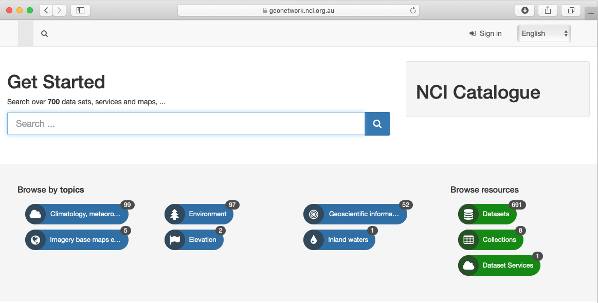

Where to Find Data
====================

You can discover the datasets published and available at NCI using our `NCI GeoNetwork catalogue`_, using ISO19115 compliant data records. 
As well as the general data catalogue, there are specialist domain information such as the `Coupled Model Intercomparison Project (CMIP)`_ 
service, or `Australasia Regional Copernicus Hub`_. Each collection and constituent dataset has 
information available as catalogue records in through the NCI GeoNetwork. 

`NCI GeoNetwork catalogue`_ provides a discoverability and search portal for these datasets. 
The NCI code listed for each dataset provides the location in the /g/data Lustre filesystem. 
NCI account holders logging in need to register for access to the data to help us track demand 
and communicate information about the data to users and stakeholders. The GeoNetwork records also 
includes a link to THREDDS data service for data that does not require authenticated access to data. 
We are progressively adding the location of the data services for these dataset records, 
including GSKY and other services.

.. _Coupled Model Intercomparison Project (CMIP): https://opus.nci.org.au/display/CMIP/CMIP+Community+Home

.. _Australasia Regional Copernicus Hub: http://www.copernicus.gov.au/

.. _NCI GeoNetwork catalogue: https://geonetwork.nci.org.au/

NCI uses internationally recognised Digital Object Identifiers (DOI) on datasets, 
which can be used to reference these datasets in journal publications or for sharing the 
location of the dataset landing page.  Our goal is to ensure that each dataset lists includes 
a reference to its license to give confidence around the use of the dataset. 

NCI tracks usage statistics around all accesses on datasets - via the open data services and 
the different protocols of access and usage, as well as in-situ access within the NCI computing systems. 
This provides information for planning and measuring demand for existing datasets, as well as 
impacts for upgrades and decommissioning of datasets.

  
Data Management at NCI 
++++++++++++++++++++++++

NCI has a team of expert data managers who  work with, organise, and curate the datasets 
for optimal accessibility, analysis and data publication and accessibility.

Our approach for data management falls into a process of making data fit-for-purpose 
for computation and programmatic access, and in the context of organising data in the 
context of a variety of funded schemes. We use the following definitions for this data:

* A **data collection** is the highest in the hierarchy of data groupings at NCI. It is comprised of either an exclusive grouping of data subcollections; or, it is a tiered structure with an exclusive grouping of lower tiered data collections, where the lowest tier data collection will only contain data subcollections.
* A **data subcollection** is an exclusive grouping of datasets (i.e., belonging to only one subcollection) where the constituent datasets are tightly managed. It must have responsibilities within one organization with responsibility for the underlying management of its constituent datasets. A data subcollection constitutes a strong connection between the component datasets, and is organized coherently around a single scientific element (e.g., model, instrument). A subcollection must have compatible licenses such that constituent datasets do not need different access arrangements.
* A **dataset** is a compilation of data that constitutes a programmable data unit that has been collected and organized using a self-contained process. For this purpose it must have a named data owner, a single license, one set of semantics, ontologies, vocabularies, and has a single data format and internal data convention. A dataset must include its version.
* A **dataset** granule is used for some scientific domains that require a finer level of granularity (e.g., in satellite Earth Observation datasets). A granule refers to the smallest aggregation of data that can be independently described, inventoried, and retrieved as defined by NASA. Dataset granules have their own metadata and support values associated with the additional attributes defined by parent datasets.

Each dataset are a data storage project. Users need to request a 
membership of the project through `Mancini`_ in order to access on Raijin. Project code 
can be found in GeoNetwork catalogues. However, data is freely available if accessing our data services, such as THREDDS or GSKY.

.. _Mancini: https://my.nci.org.au/

NCI mostly focuses on datasets since it is an more 
tightly defined data product, and uses subcollections and collections to organise for both 
data management and licensing requirements. These definitions have been described in more details in a peer reviewed paper on our 
approach to `Quality Data Management <../_static/paper/informatics-04-00045.pdf>`_.  