GSKY interacts with QGIS
===============================================================

This tutorial demonstrate how to load the GSKY WMS layer into QGIS. In this tutorial, you will learn to add the layer by calling GSKY WMS server. See `here <../eo/QGIS_Analysing_Visualising_Data.ipynb>`_ for more advanced usage of QGIS.

Introduction
~~~~~~~~~~~~~~~~~~~~~~~

`QGIS`_ is a user-friendly Open Source Geographic Information System (GIS) licensed under the GNU General Public License. QGIS is an official project of the Open Source Geospatial Foundation (OSGeo). It runs on Linux, Unix, Mac OSX, Windows and Android and supports numerous vector, raster, and database formats and functionalities. 
 
.. _QGIS: https://qgis.org/en/site/about/index.html

In this tutorial, we are going to demonstrate 

* Create a map showing evacuation routes in Houston
* Use smart mapping and pop-ups to determine areas with low vehicle ownership.
* Configure a web app to share your findings with others.

0. Prerequisite 
~~~~~~~~~~~~~~~~~~~~~~~

You need to install QGIS on your desktop, or you can run QGIS on NCI's VDI. We demonstrate how to load GSKY layer into QGIS on VDI in this tutorial. 

1. Launch QGIS 
~~~~~~~~~~~~~~~~~~~~~~~~~~~~~~~~~~~~~~~~

.. image:: images/GSKY_QGIS1.png

2. Add GSKY WMS layer
~~~~~~~~~~~~~~~~~~~~~~~

Click "Layer | Add Layer | Add WMS/WMTS Layer"  

.. image:: images/GSKY_QGIS2.png

In the "Data Source Manager", click "New"

.. image:: images/GSKY_QGIS3.png

Type "Name" and "URL" https://gsky.nci.org.au/ows/geoglam, click "OK".

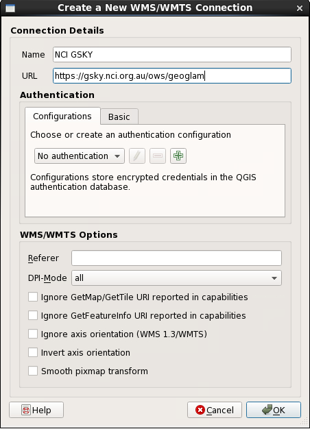

In the "Data Source Manager", click "Connect"

.. image:: images/GSKY_QGIS5.png

A list of GSKY layers is presented in the box.

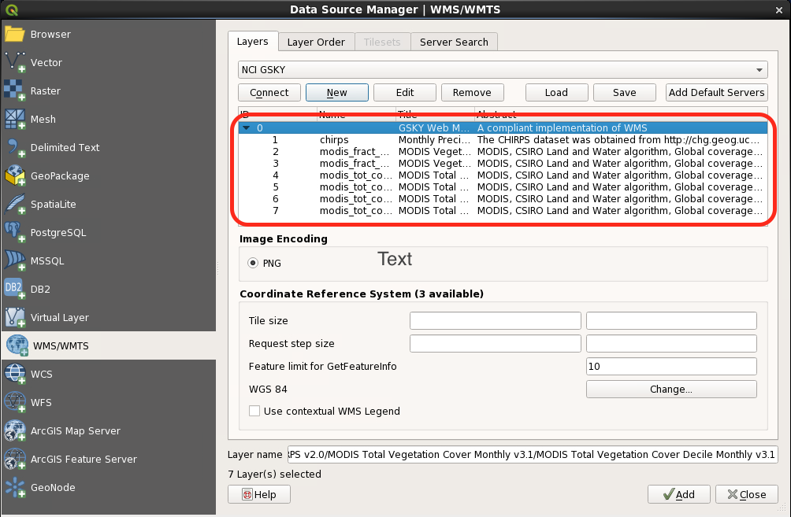

Click "Add" and then "close" the window. Choose "WMS/WMTS | NCI GSKY | Layer name".

.. image:: images/GSKY_QGIS7.png

You can save the layer by click "Save" button on the menu bar.

3. Add GSKY WCS layer
~~~~~~~~~~~~~~~~~~~~~~~

Click "Layer | Add Layer | Add WCS Layer"  

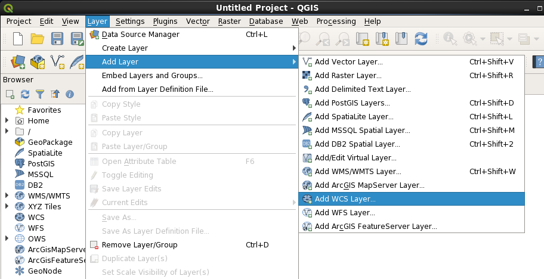

In the "Data Source Manager", click "New"

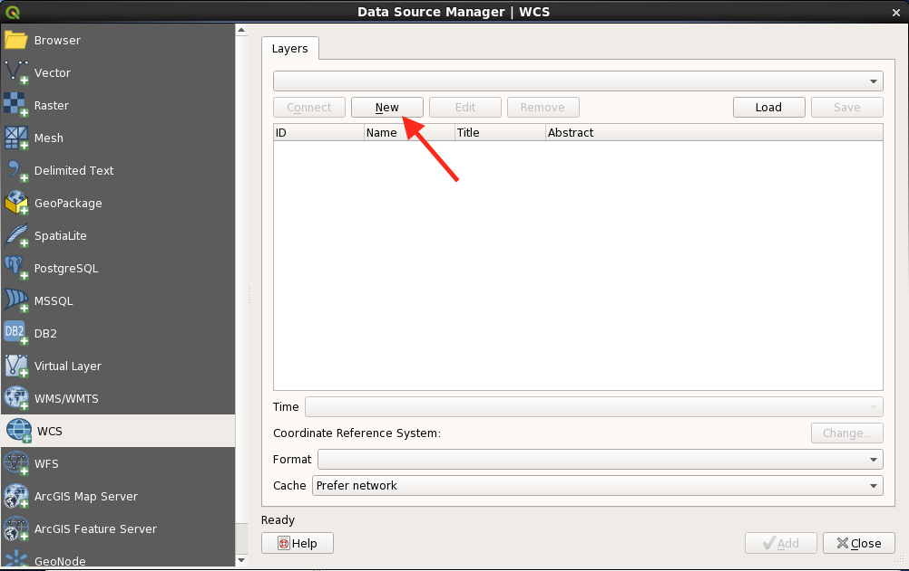

Type "Name" GSKY WCS and "URL" https://gsky.nci.org.au/ows/geoglam, click "OK".

.. image:: images/GSKY_QGIS10.png

In the "Data Source Manager", click "Connect"

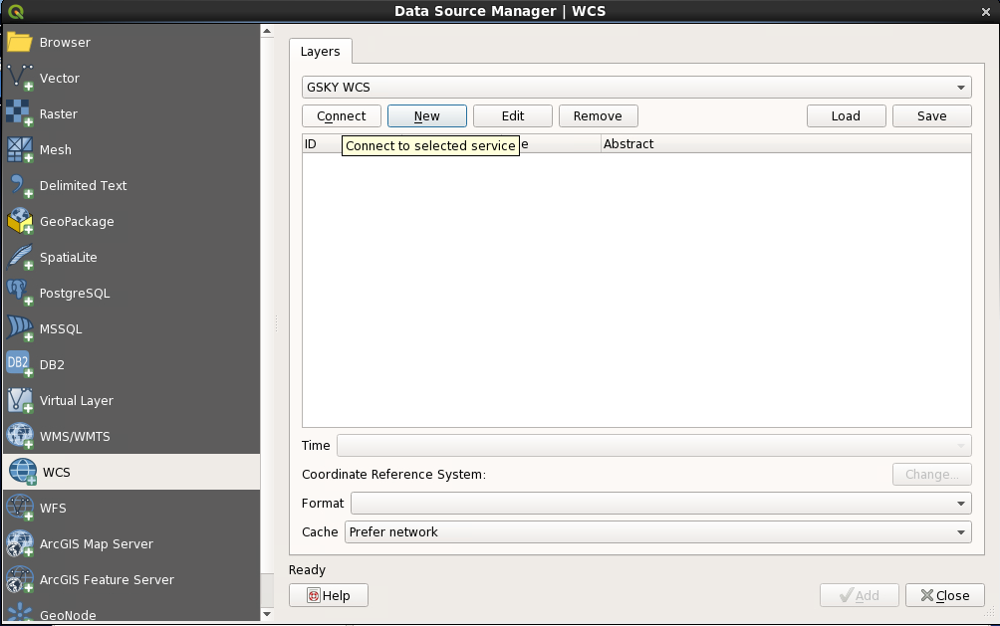

A list of GSKY layers is presented in the box.

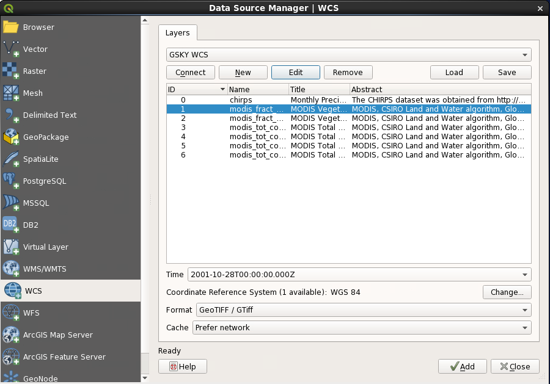

Time, CRS, and Format can be selected from this window.

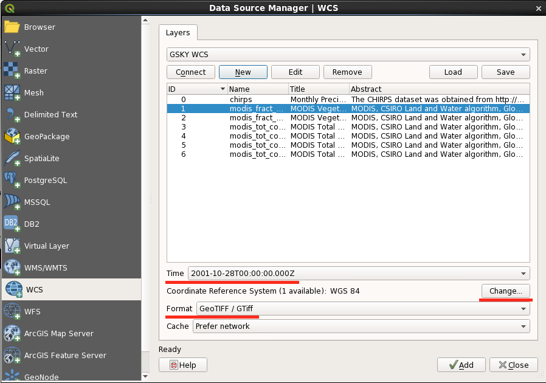

Click "Time" and then scroll up and down to choose the time 

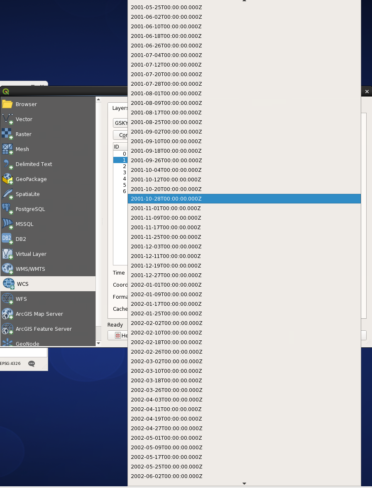

Once you are happy with your choice, click "Add". 

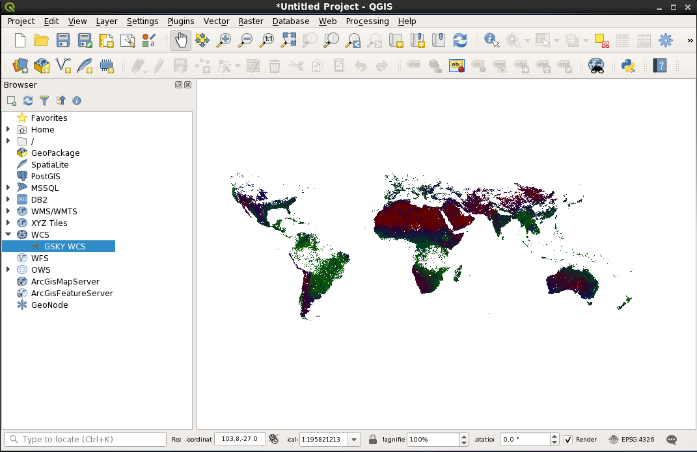

Use zoom in button to select the area of your interests.

.. image:: images/GSKY_QGIS16.png

You can save the layer by click "Layer | save as ... " button on the menu bar.

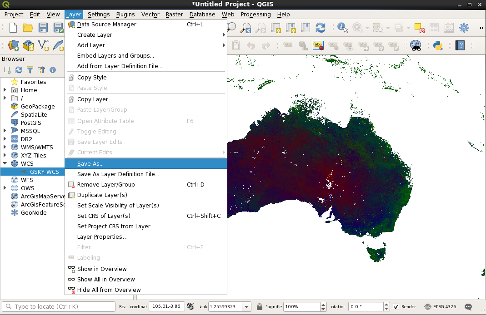

You can define your output parameters. 

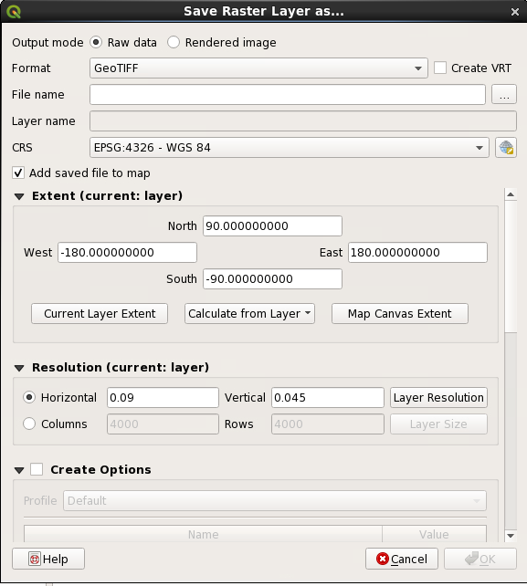

There are a number of output formats can be selected from the list.

.. image:: images/GSKY_QGIS19.png
