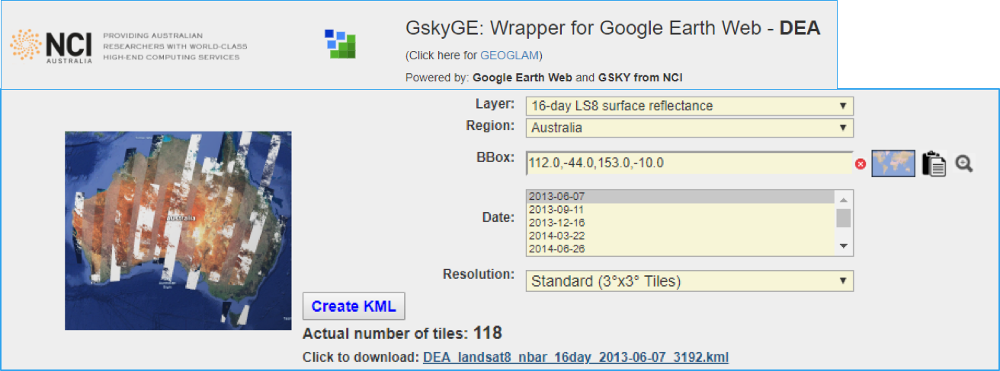
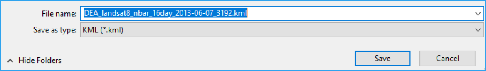
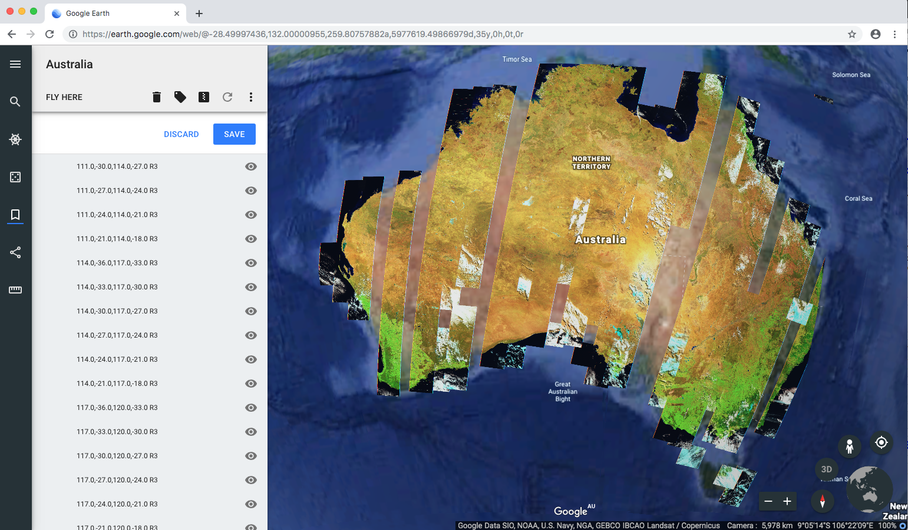

Google Earth Web - A web app to use Google Earth Web with EDA
===============================================================

We demonstrate how to create the KMLs for Google Earth Web (GEWeb) to simulate GSKY web mapping service.

Introduction
~~~~~~~~~~~~~~~~~~~~~~~

Google Earth Web (“GEWeb”) is a web-based version of the Google Earth Pro desktop (“GE”). While it has many new features, it lacks some that are in GE. Of these, the main missing item is a WMS facility. Unlike GE which can take a WMS server URL (e.g. GSKY server) and display the layers, GEWeb lacks this feature. It uses a KML (Keyhole Markup Language) to display static images. This facility is experimental and was included so that users could import the maps saved in GE.

The primary advantage of using GEWeb over GE is that it is platform independent. But it is browser-dependent and currently works only in Google Chrome. There is a mobile app as well.

To GSKY it offers another advantage as well. While WMS is possible in GE, there is no way to display time-based layers. The “GetMap” request sent by GE does not carry the “TIME=“ parameter. There is no way, as yet, to add this by us. Hence, only the latest time slice can be shown.

0. Prerequisite 
~~~~~~~~~~~~~~~~~~~~~~~

You need a Google Chrome to run the Google Earth Web application. Other web browsers such as firefox, safari, Internet Explorer, etc, do not support Google Earth Web application.

1. Lauch Digital Earth Australia server
~~~~~~~~~~~~~~~~~~~~~~~~~~~~~~~~~~~~~~~~
Type this link in your web browser: http://130.56.242.19/dea.html. 

Note, you need VPN to run this internal server until it is publicly available to external users.

2. Create a KML file
~~~~~~~~~~~~~~~~~~~~~~~~

You can select the following parameters to define the time and space of the imagee:

  * layer
  * Region
  * Bounding Box in Lat and Lon
  * Date
  * Resolution
  

Parameters are selected as in the screenshot below.

Once it is done, you can click "Create KML" button at the bottom and save it as a KML file with the name you give. 

3. Open the KML file in the Google Earth Web
~~~~~~~~~~~~~~~~~~~~~~~~~~~~~~~~~~~~~~~~~~~~~~~

Open https://earth.google.com/web in Google Chrome. You might need to enable KML import in Settings if this is the first time you use google earth web application. 

See the link at the bottom of the page.

.. image:: images/chrome_setting.png

Click "Settings", it open the setting page. Scroll down to the bottom and enable the KML import funciton, then save the setting.

.. image:: images/chrome_setting2.png

Now the "IMPORT KML FILE" option should appear on the left column bar. 

.. image:: images/GSKY_googleweb_dea3.png

Then click "IMPORT KML FILE", select the KML file that you just saved. The KML file is now loaded into the Google Earth Web. 

Click ``allow`` when saving the images on the web. 
Rename it by right clicking the name and select ``rename`` button. ``Australia LS8 TC SR`` is given for this demostration example.
The current KML layer can be hid by unticking the view icon on the right side of the name.
You can keep importting more layers if you like. Each KML files will be listed on the left column. 

4. Get Bounding Box using BBox Finder
~~~~~~~~~~~~~~~~~~~~~~~~~~~~~~~~~~~~~~~~~~

To display the GSKY layers over a region not listed, you can find its Lat/Lon coordinates using an inbuilt “Bbox Finder”.

.. image:: images/GSKY_googleweb_dea5.png
