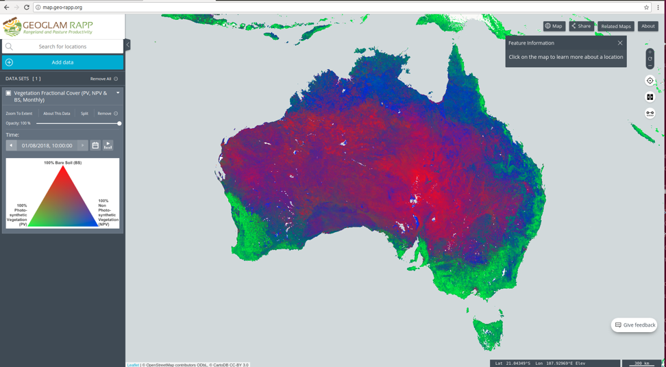
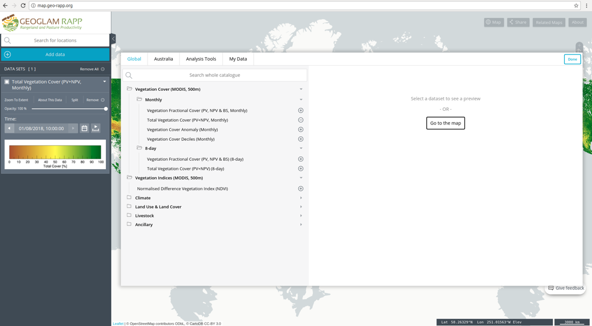
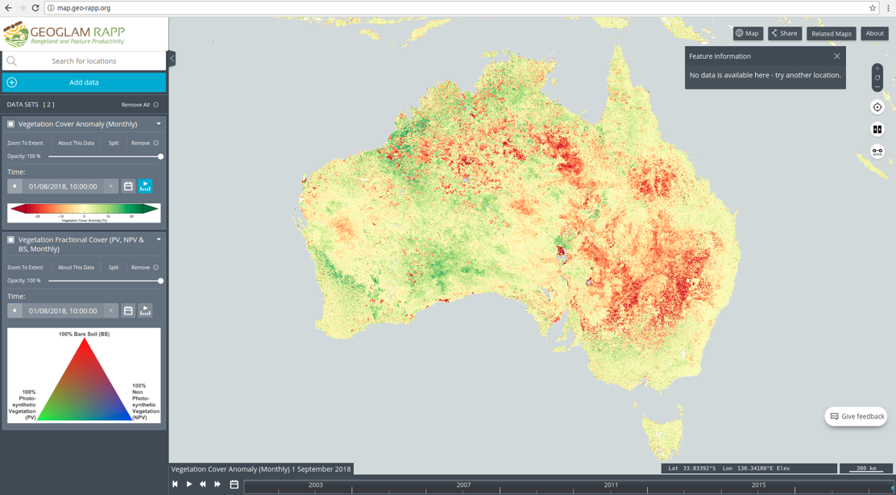

TerriaJS
===========
`TerriaJS`_ is an open-source framework for web-based geospatial catalog explorers. The TerriaJS portal is target software that is used by some major projects NCI collaborates with:

 * `GEOGLAM RAPP`_
 * `Digital Earth Australia`_
 * `National Map`_

.. _GEOGLAM RAPP: https://www.geo-rapp.org/
.. _Digital Earth Australia: http://www.ga.gov.au/about/projects/geographic/digital-earth-australia
.. _National Map: http://nationalmap.gov.au/
.. _TerriaJS: https://terria.io/

As an example, we can add MODIS Fractional Cover time series as a single layer to the GEOGLAM RAPP map. The GEOGLAM data portal contacts the GSKY server to provide a monthly MODIS fractional cover layer with three bands. This MODIS FC time series dates back to 2001:

GSKY also provides access to data subsets (e.g., group of variables of interest) as data layers:

GSKY is able to serve multiple layers simultaneously overlaying on top of each other for comparative analysis:

GSKY can provide the same layer for different points of time allowing cross- sectional analysis:

.. image:: images/GG3.png

Above we see a comparison of fractional coverage between August 2018 (left) and August 2017 (right). Note the increase of fractional coverage around Perth and the decrease around NSW.

GSKY's WCS service allows users to download the raw data corresponding to a user-supplied bounding box. Note the “export” button in the following screenshot:

.. image:: images/GG4.png

Simply draw a bounding box and the raw data corresponding to this selection will be downloadable:

.. image:: images/GG5.png

The stand-alone visualisation of the downloaded data file, as per the selection made via a click-and-ship:

.. image:: images/GG6.png

